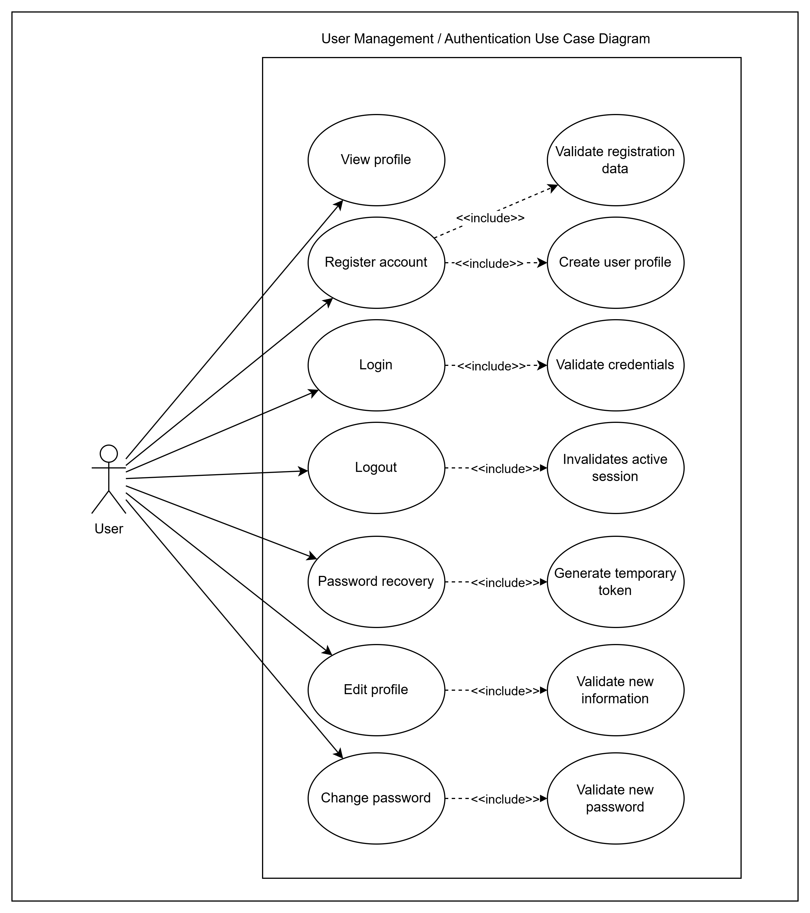
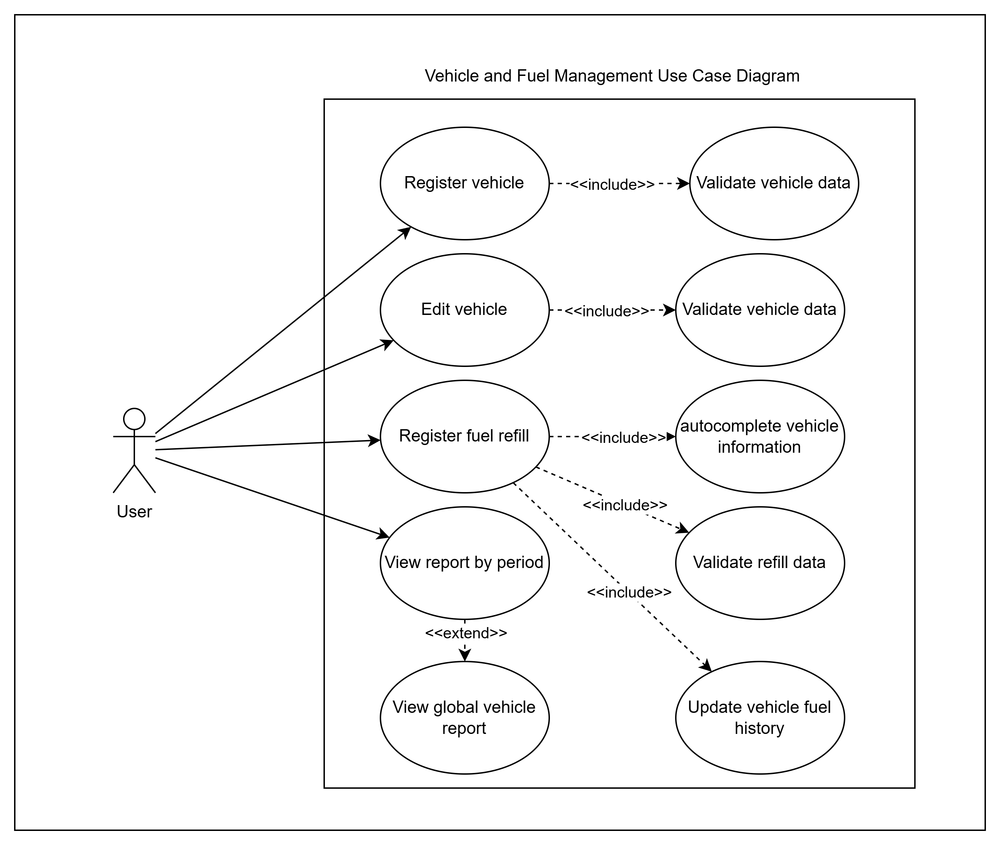

# 🧩 FuelFlow MVP — Use Cases Documentation

## 📌 Overview

This document contains the UML-based use case specifications for **FuelFlow MVP Phase 1**.

The use cases describe how the user interacts with the system and how the system responds during the main functional flows.

---

# 👤 User Management Use Cases

## UC-01 — User Registration

| Field | Description |
|---|---|
| Related requirements | RF-09.1, RF-09.3, RF-10.1 |
| Primary actor | User |
| Goal | Create a user account and profile. |
| Preconditions | The user does not have an active session. |
| Postconditions | A user account is created. A user profile is created. The password is stored as a hash, not plain text. |

### Main Flow

| Step | Description |
|---|---|
| 1 | The user opens the registration page. |
| 2 | The user enters email, username, and password. |
| 3 | The system validates the email format. |
| 4 | The system validates that the email is not already registered. |
| 5 | The system validates that the username is not already registered. |
| 6 | The system validates the password rules. |
| 7 | The system hashes the password. |
| 8 | The system creates the user account. |
| 9 | The system creates the user profile. |
| 10 | The system confirms successful registration. |

### Alternative Flows

| ID | Description |
|---|---|
| AF-01 | Invalid email format. |
| AF-02 | Email already registered. |
| AF-03 | Username already registered. |
| AF-04 | Password does not meet security rules. |
| AF-05 | Required fields are missing. |

---

## UC-02 — User Login

| Field | Description |
|---|---|
| Related requirement | RF-09.2 |
| Primary actor | User |
| Goal | Access the system using registered credentials. |
| Preconditions | The user account exists. The user does not have an active session. |
| Postconditions | The user has an active session. |

### Main Flow

| Step | Description |
|---|---|
| 1 | The user opens the login page. |
| 2 | The user enters email and password. |
| 3 | The system validates that both fields are provided. |
| 4 | The system searches for the account by email. |
| 5 | The system compares the entered password with the stored password hash. |
| 6 | The system creates an active session. |
| 7 | The system redirects the user to the dashboard. |

### Alternative Flows

| ID | Description |
|---|---|
| AF-01 | Email is not registered. |
| AF-02 | Password is incorrect. |
| AF-03 | Required fields are missing. |

---

## UC-03 — Secure Logout

| Field | Description |
|---|---|
| Related requirement | RF-09.8 |
| Primary actor | User |
| Goal | End the active session securely. |
| Preconditions | The user is logged in. |
| Postconditions | The user no longer has an active session. |

### Main Flow

| Step | Description |
|---|---|
| 1 | The user selects the logout option. |
| 2 | The system invalidates the active session. |
| 3 | The system redirects the user to the login page. |

### Alternative Flows

| ID | Description |
|---|---|
| AF-01 | Session already expired. |

---

## UC-04 — Password Recovery

| Field | Description |
|---|---|
| Related requirement | RF-09.9 |
| Primary actor | User |
| Goal | Recover access to the account when the password is forgotten. |
| Preconditions | The user account exists. |
| Postconditions | The user password is updated. The old password can no longer be used. |

### Main Flow

| Step | Description |
|---|---|
| 1 | The user selects “Forgot password”. |
| 2 | The user enters the registered email. |
| 3 | The system validates the email format. |
| 4 | The system checks if the email exists. |
| 5 | The system generates a temporary recovery token or code. |
| 6 | The system sends the recovery token or code to the user email. |
| 7 | The user opens the recovery link or enters the code. |
| 8 | The user enters a new password. |
| 9 | The system validates the new password rules. |
| 10 | The system hashes the new password. |
| 11 | The system updates the password. |
| 12 | The system confirms successful password recovery. |

### Alternative Flows

| ID | Description |
|---|---|
| AF-01 | Invalid email format. |
| AF-02 | Email not registered. |
| AF-03 | Recovery token expired. |
| AF-04 | Recovery token invalid. |
| AF-05 | New password does not meet security rules. |

---

## UC-05 — View User Profile

| Field | Description |
|---|---|
| Related requirement | RF-10.2 |
| Primary actor | User |
| Goal | View personal profile information. |
| Preconditions | The user is logged in. |
| Postconditions | The user can view the profile information. |

### Main Flow

| Step | Description |
|---|---|
| 1 | The user opens the profile section. |
| 2 | The system retrieves the user profile. |
| 3 | The system displays email, username, and phone number. |

### Alternative Flows

| ID | Description |
|---|---|
| AF-01 | User profile cannot be loaded. |

---

## UC-06 — Edit User Profile

| Field | Description |
|---|---|
| Related requirements | RF-10.3, RF-10.4, RF-10.7 |
| Primary actor | User |
| Goal | Update personal profile information. |
| Preconditions | The user is logged in. |
| Postconditions | The profile information is updated. |

### Main Flow

| Step | Description |
|---|---|
| 1 | The user opens the profile edit section. |
| 2 | The user modifies username, phone number, or email. |
| 3 | The system validates the format of the modified data. |
| 4 | The system checks that the new email or username is not already used by another account. |
| 5 | The system saves the updated profile. |
| 6 | The system confirms the update. |

### Alternative Flows

| ID | Description |
|---|---|
| AF-01 | Invalid email format. |
| AF-02 | Invalid phone number format. |
| AF-03 | Username already used. |
| AF-04 | Email already used. |
| AF-05 | Required fields are missing. |

---

## UC-07 — Change Password

| Field | Description |
|---|---|
| Related requirement | RF-10.6 |
| Primary actor | User |
| Goal | Change the current password from the profile settings. |
| Preconditions | The user is logged in. |
| Postconditions | The user password is updated securely. |

### Main Flow

| Step | Description |
|---|---|
| 1 | The user opens the change password section. |
| 2 | The user enters current password and new password. |
| 3 | The system validates the current password. |
| 4 | The system validates the new password rules. |
| 5 | The system hashes the new password. |
| 6 | The system updates the password. |
| 7 | The system confirms the password change. |

### Alternative Flows

| ID | Description |
|---|---|
| AF-01 | Current password is incorrect. |
| AF-02 | New password does not meet security rules. |
| AF-03 | Required fields are missing. |

---

# 🚗 Vehicle and Fuel Management Use Cases

## UC-08 — Register Vehicle

| Field | Description |
|---|---|
| Related requirement | RF-05.1 |
| Primary actor | User |
| Goal | Register a vehicle for fuel tracking. |
| Preconditions | The user is logged in. |
| Postconditions | The vehicle is registered and linked to the user. |

### Main Flow

| Step | Description |
|---|---|
| 1 | The user opens the vehicle registration form. |
| 2 | The user enters name, brand, model, year, plate, initial odometer, tank capacity in liters, and fuel type. |
| 3 | The system validates the entered data. |
| 4 | The system associates the vehicle with the user account. |
| 5 | The system saves the vehicle. |
| 6 | The system confirms successful registration. |

### Alternative Flows

| ID | Description |
|---|---|
| AF-01 | Required fields are missing. |
| AF-02 | Invalid year. |
| AF-03 | Invalid odometer value. |
| AF-04 | Invalid tank capacity. |
| AF-05 | Vehicle plate already registered for the same user. |

---

## UC-09 — Edit Vehicle

| Field | Description |
|---|---|
| Related requirement | RF-05.3 |
| Primary actor | User |
| Goal | Edit vehicle information. |
| Preconditions | The user is logged in. The vehicle exists and belongs to the user. |
| Postconditions | The vehicle information is updated. |

### Main Flow

| Step | Description |
|---|---|
| 1 | The user selects a registered vehicle. |
| 2 | The user opens the edit vehicle form. |
| 3 | The user modifies vehicle information. |
| 4 | The system validates the modified data. |
| 5 | The system saves the changes. |
| 6 | The system confirms the update. |

### Alternative Flows

| ID | Description |
|---|---|
| AF-01 | Vehicle does not exist. |
| AF-02 | Vehicle does not belong to the user. |
| AF-03 | Invalid data entered. |

---

## UC-10 — Register Fuel Refill

| Field | Description |
|---|---|
| Related requirements | RF-04.1, RF-04.2, RF-04.7 |
| Primary actor | User |
| Goal | Register a partial or full fuel refill. |
| Preconditions | The user is logged in. The user has at least one registered vehicle. |
| Postconditions | The fuel refill is registered. The refill is associated with the selected vehicle. Reports and virtual tank data are updated. |

### Main Flow

| Step | Description |
|---|---|
| 1 | The user opens the fuel refill registration form. |
| 2 | The system selects the vehicle automatically if the user has only one registered vehicle. |
| 3 | If the user has more than one vehicle, the user selects the vehicle manually. |
| 4 | The system autocompletes vehicle name, fuel type, tank capacity in liters, and estimated odometer. |
| 5 | The user enters date and time, liters refilled, price per liter, total paid, and odometer. |
| 6 | The system validates the entered data. |
| 7 | The system allows the user to modify any autocompleted data before saving. |
| 8 | The system saves the refill. |
| 9 | The system updates the vehicle fuel history. |
| 10 | The system updates report and virtual tank calculations. |
| 11 | The system confirms successful refill registration. |

### Alternative Flows

| ID | Description |
|---|---|
| AF-01 | No vehicle registered. |
| AF-02 | Required fields are missing. |
| AF-03 | Invalid liters value. |
| AF-04 | Invalid price per liter. |
| AF-05 | Invalid total paid. |
| AF-06 | Invalid odometer value. |
| AF-07 | Odometer is lower than the previous recorded odometer. |

---

# 📊 Dashboard and Reporting Use Cases

## UC-11 — View Global Vehicle Report

| Field | Description |
|---|---|
| Related requirements | RF-02.2, RF-03.1, RF-03.2 |
| Primary actor | User |
| Goal | Automatically display the global vehicle report and virtual tank in the dashboard. |
| Preconditions | The user is logged in. At least one vehicle exists and belongs to the user. The selected vehicle has refill history. |
| Postconditions | The dashboard displays the global vehicle report. The dashboard displays the virtual tank indicator. |

### Main Flow

| Step | Description |
|---|---|
| 1 | The user logs into the system. |
| 2 | The system loads the dashboard. |
| 3 | The system automatically selects the last used vehicle or the default vehicle. |
| 4 | The system retrieves the refill history of the selected vehicle. |
| 5 | The system calculates total registered mileage, total liters refilled, accumulated fuel cost, average fuel performance, estimated autonomy in kilometers, estimated tank percentage, and historical average fuel performance in km/L. |
| 6 | The system displays the global vehicle report in the dashboard. |
| 7 | The system displays the virtual tank indicator as part of the global vehicle report. |

### Alternative Flows

| ID | Description |
|---|---|
| AF-01 | The user has no registered vehicles. |
| AF-02 | The selected vehicle has no refill history. |
| AF-03 | The report cannot be calculated due to incomplete refill data. |
| AF-04 | The virtual tank cannot be estimated due to insufficient data. |

---

## UC-12 — View Report by Period

| Field | Description |
|---|---|
| Related requirement | RF-02.3 |
| Primary actor | User |
| Goal | View the vehicle report filtered by a specific period. |
| Preconditions | The user is logged in. The vehicle exists and belongs to the user. The vehicle has refill history. |
| Postconditions | The period report is displayed. |

### Main Flow

| Step | Description |
|---|---|
| 1 | The user selects a vehicle. |
| 2 | The user selects a period: day, week, month, or year. |
| 3 | The system filters the refill history by the selected period. |
| 4 | The system calculates the same information used in the global report for the selected period. |
| 5 | The system displays the filtered report. |

### Alternative Flows

| ID | Description |
|---|---|
| AF-01 | No refill data exists for the selected period. |
| AF-02 | Invalid period selected. |
| AF-03 | Report cannot be calculated due to incomplete data. |

---

# 🖼️ UML Use Case Diagrams

> **NOTE**
>
> The following diagrams summarize the main user interactions for Phase 1.  
> The detailed flows remain documented in the use case specifications above.

## User Management Diagram

## Vehicle and Fuel Management Diagram

---

# 📚 Related Documentation

⬅️ Previous document: [Requirements Documentation](01-requirements.md)

➡️ Next document: [Activity Diagrams Documentation](03-activity-diagrams.md)

This next document contains the main UML activity diagrams for FuelFlow MVP Phase 1.
