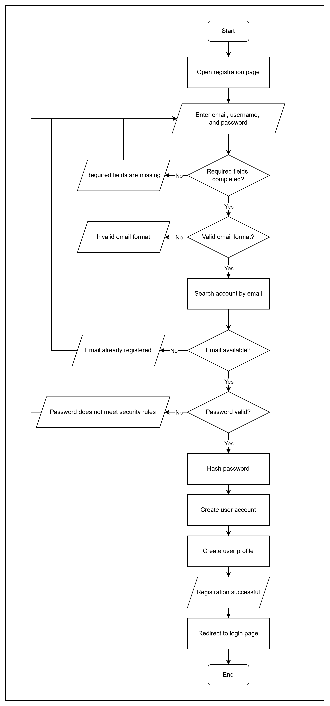
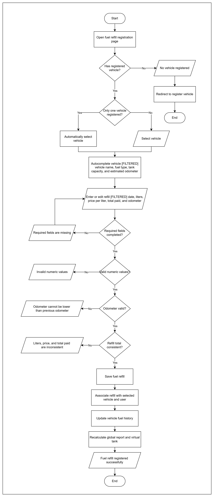
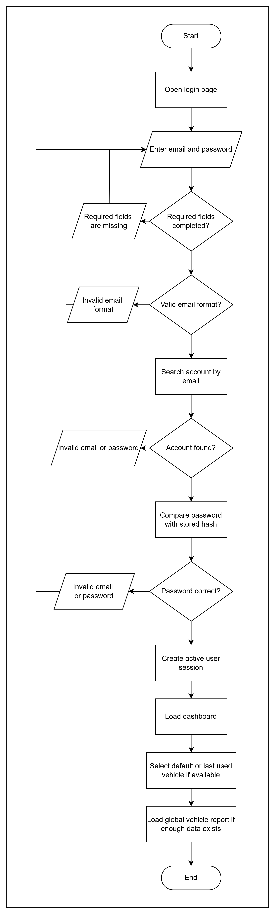
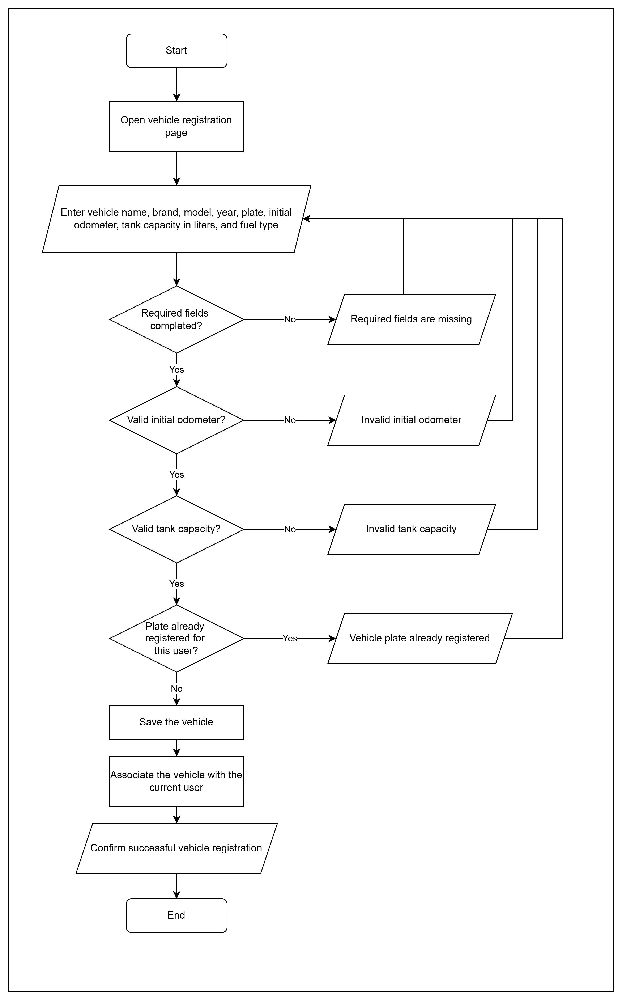
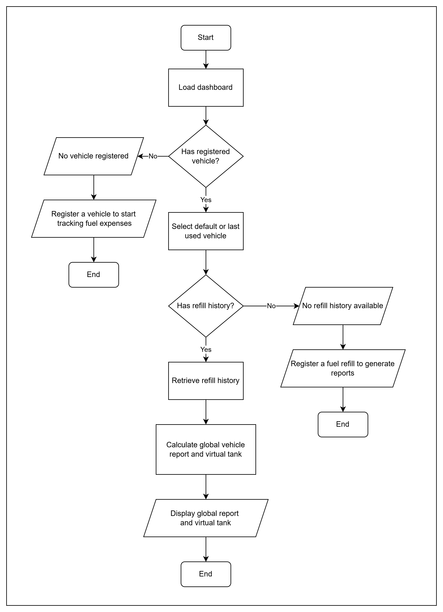
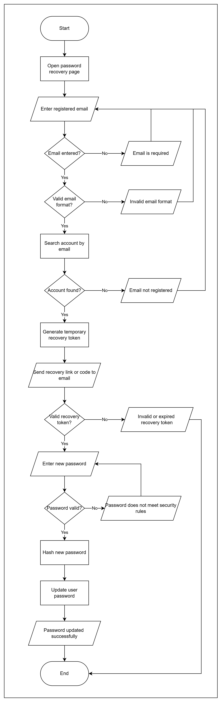
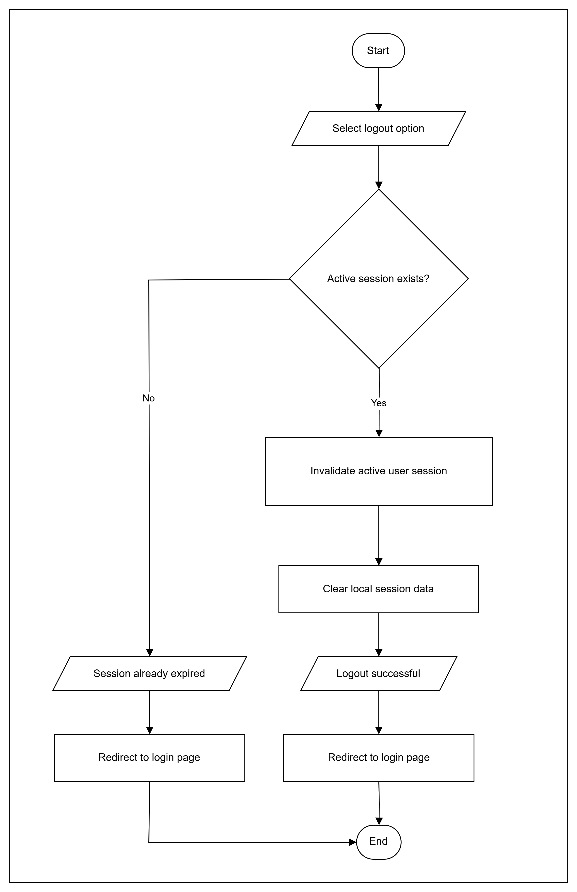
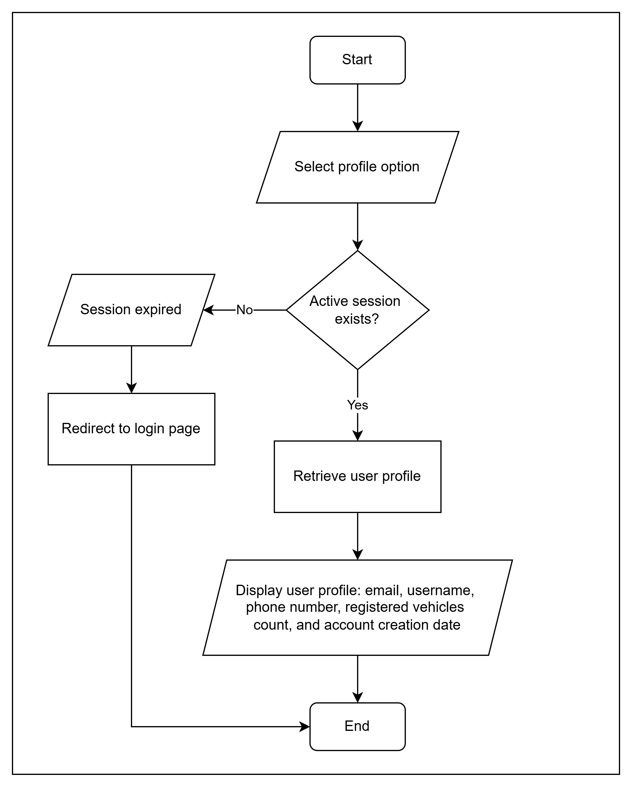
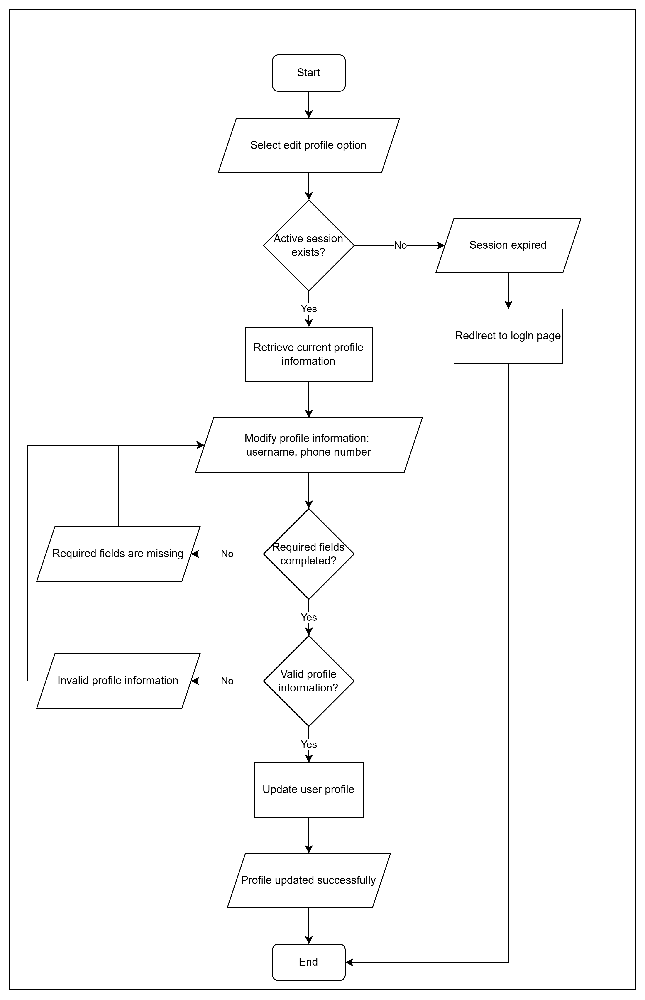
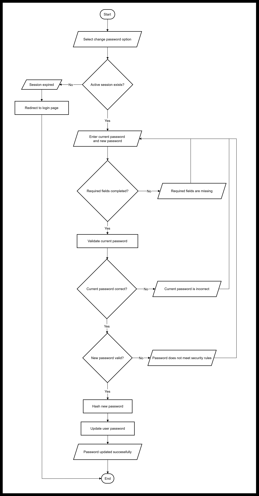

# 🔄 Activity Diagrams

> [!NOTE]
> This document contains the UML Activity Diagrams for FuelFlow MVP Phase 1.

---

## 📌 Purpose

The purpose of these diagrams is to describe how the main FuelFlow MVP processes behave internally.

They show:

- user actions
- system actions
- validations
- alternative flows
- error handling
- success paths
- process endings

These diagrams complement the use case documentation by showing the internal flow of each feature.

---

## 📁 Diagram Location

All diagram images are stored in:

```text
docs/diagrams/
```

---

## 📋 Diagram Index

| # | Diagram | File |
|---|---|---|
| 01 | User Registration Activity Diagram | `user-registration-activity-diagram.png` |
| 02 | Fuel Refill Registration Activity Diagram | `fuel-refill-registration-activity-diagram.png` |
| 03 | User Login Activity Diagram | `user-login-activity-diagram.png` |
| 04 | Register Vehicle Activity Diagram | `register-vehicle-activity-diagram.png` |
| 05 | Dashboard Report Load Activity Diagram | `dashboard-report-load-activity-diagram.png` |
| 06 | Password Recovery Activity Diagram | `password-recovery-activity-diagram.png` |
| 07 | Logout Activity Diagram | `logout-activity-diagram.png` |
| 08 | View Profile Activity Diagram | `view-profile-activity-diagram.png` |
| 09 | Edit Profile Activity Diagram | `edit-profile-activity-diagram.png` |
| 10 | Change Password Activity Diagram | `change-password-activity-diagram.png` |

---

# 🧩 Activity Diagrams

## 01. User Registration Activity Diagram

Shows how a new user creates an account and profile.

This flow includes email validation, email availability verification, password validation, password hashing, account creation, profile creation, and redirection to the login page.



---

## 02. Fuel Refill Registration Activity Diagram

Shows how the user registers a partial or full fuel refill.

This flow includes vehicle selection, automatic vehicle data completion, refill data entry, refill validation, odometer validation, refill consistency validation, fuel history update, global report recalculation, and virtual tank recalculation.



---

## 03. User Login Activity Diagram

Shows how the user logs into the system using email and password.

This flow includes required field validation, email format validation, account lookup, password hash comparison, session creation, dashboard loading, default vehicle selection, and global report loading.



---

## 04. Register Vehicle Activity Diagram

Shows how the user registers a vehicle in the system.

This flow includes vehicle data entry, required field validation, odometer validation, tank capacity validation, duplicate plate validation within the same user account, vehicle creation, and user-vehicle association.



---

## 05. Dashboard Report Load Activity Diagram

Shows how the dashboard loads the global vehicle report.

This flow includes vehicle existence validation, refill history validation, report calculation, virtual tank calculation, and dashboard visualization.



---

## 06. Password Recovery Activity Diagram

Shows how the user recovers account access after forgetting the password.

This flow includes email validation, account lookup, recovery token generation, recovery link or code delivery, token validation, new password validation, password hashing, and password update.



---

## 07. Logout Activity Diagram

Shows how the user ends an active session.

This flow includes session verification, session invalidation, local session data cleanup, logout confirmation, and redirection to the login page.



---

## 08. View Profile Activity Diagram

Shows how the user views profile information.

This flow includes session validation, profile retrieval, and display of user information such as email, username, phone number, registered vehicles count, and account creation date.



---

## 09. Edit Profile Activity Diagram

Shows how the user edits basic profile information.

This flow includes session validation, current profile retrieval, profile data modification, required field validation, profile information validation, profile update, and success confirmation.



---

## 10. Change Password Activity Diagram

Shows how an authenticated user changes the current password.

This flow includes session validation, current password entry, new password entry, required field validation, current password verification, new password validation, password hashing, password update, and success confirmation.



---

# 📚 Related Documentation

⬅️ Previous document: [Use Cases Documentation](use-cases.md)

➡️ Next document: [Database Design Documentation](database-design.md)

his document continues the system design process by defining the FuelFlow MVP Phase 1 database structure, entities, attributes, relationships, normalization review, and relational model.
