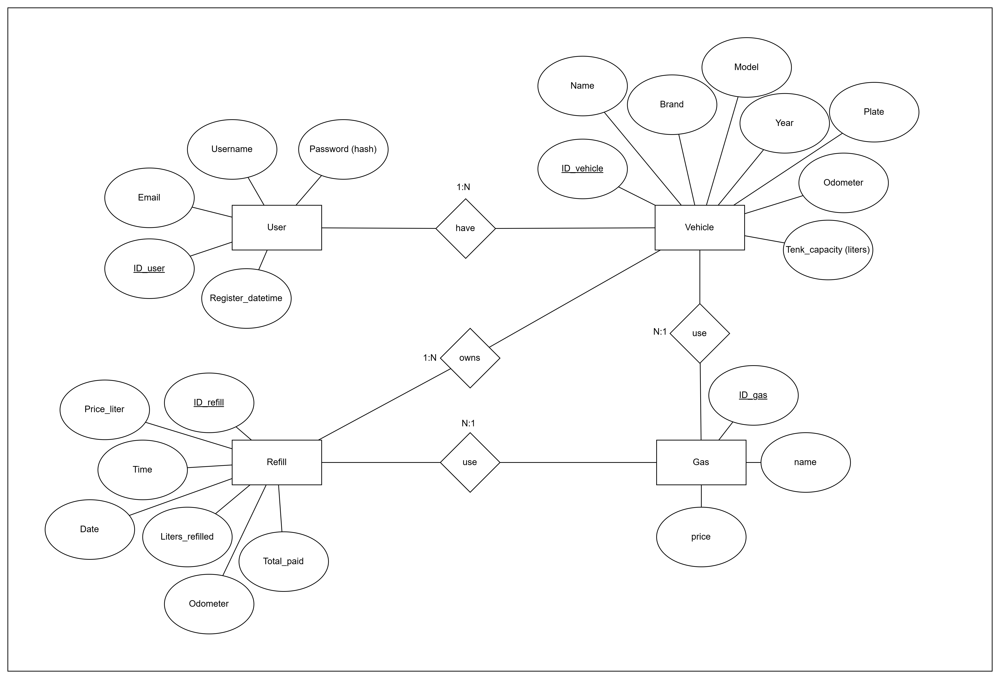
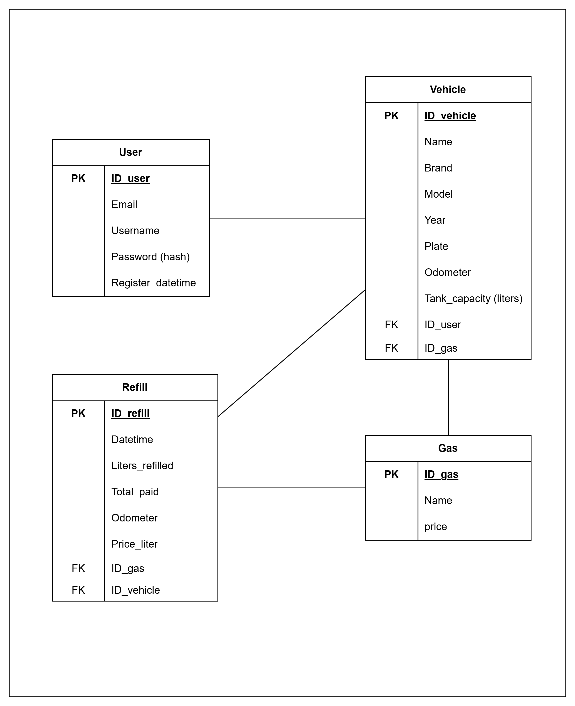

# 🗄️ Database Design Documentation

This document describes the FuelFlow MVP Phase 1 database design, including the Entity-Relationship Diagram (ERD), Relational Model, Data Dictionary, Relationship Analysis, and Normalization Review.

---

# 📖 Overview

The FuelFlow MVP database was designed to support:

- User management
- Vehicle registration
- Fuel type management
- Fuel refill tracking

The design follows relational database principles and was reviewed up to Third Normal Form (3NF).

---

# 📊 Entity Relationship Diagram (ERD)

The following diagram represents the conceptual data model and the relationships between the main entities.

## Entities

### User

Stores user account information.

### Vehicle

Stores registered vehicles and their fuel-related information.

### Gas

Stores available fuel types and current reference prices.

### Refill

Stores fuel refill records associated with vehicles.

---

# 🗃️ Relational Model

The following diagram represents the relational structure derived from the ERD.

---

# 📚 Data Dictionary

## User

| Field | Data Type | Description |
|---------|---------|---------|
| ID_user | INT (PK) | Unique user identifier |
| Email | VARCHAR(100) | User email address |
| Username | VARCHAR(50) | Username |
| Password | VARCHAR(255) | Encrypted password |
| Register_datetime | DATETIME | Account creation date and time |

---

## Vehicle

| Field | Data Type | Description |
|---------|---------|---------|
| ID_vehicle | INT (PK) | Unique vehicle identifier |
| Name | VARCHAR(50) | Vehicle name |
| Brand | VARCHAR(50) | Vehicle manufacturer |
| Model | VARCHAR(50) | Vehicle model |
| Year | SMALLINT | Manufacturing year |
| Plate | VARCHAR(12) | Vehicle license plate |
| Odometer | DECIMAL(8) | Current vehicle odometer |
| Tank_capacity | DECIMAL(3,2) | Fuel tank capacity in liters |
| ID_user | INT (FK) | Owner user |
| ID_gas | INT (FK) | Assigned fuel type |

---

## Gas

| Field | Data Type | Description |
|---------|---------|---------|
| ID_gas | INT (PK) | Unique fuel identifier |
| Name | VARCHAR(20) | Fuel name |
| Price | DECIMAL(4,2) | Current reference fuel price |

---

## Refill

| Field | Data Type | Description |
|---------|---------|---------|
| ID_refill | INT (PK) | Unique refill identifier |
| DateTime | DATETIME | Date and time of refill |
| Liters_refilled | DECIMAL(4,3) | Fuel quantity loaded |
| Total_paid | DECIMAL(10,2) | Total amount paid |
| Odometer | DECIMAL(8) | Vehicle odometer at refill |
| Price_liter | DECIMAL(4,2) | Historical fuel price per liter |
| ID_gas | INT (FK) | Fuel type used |
| ID_vehicle | INT (FK) | Related vehicle |

---

# 🔗 Relationship Analysis

| Entity A | Entity B | Relationship | Foreign Key | Justification |
|-----------|-----------|-----------|-----------|-----------|
| User | Vehicle | 1:N | ID_user in Vehicle | One user can register multiple vehicles |
| Gas | Vehicle | 1:N | ID_gas in Vehicle | One fuel type can be used by multiple vehicles |
| Vehicle | Refill | 1:N | ID_vehicle in Refill | One vehicle can have multiple refills |
| Gas | Refill | 1:N | ID_gas in Refill | One fuel type can appear in multiple refills |

---

# 📋 Relationship Summary

| Main Table | Related Table | Relationship | Foreign Key | FK Stored In |
|------------|------------|------------|------------|------------|
| User | Vehicle | 1:N | ID_user | Vehicle |
| Gas | Vehicle | 1:N | ID_gas | Vehicle |
| Vehicle | Refill | 1:N | ID_vehicle | Refill |
| Gas | Refill | 1:N | ID_gas | Refill |

---

>[!Note]

>The database design was reviewed up to Third Normal Form (3NF).

>The model is considered normalized up to 3NF for the scope of FuelFlow MVP Phase 1.

---

# 📚 Related Documentation

⬅️ Previous document: [Activity Diagrams Documentation](activity-diagrams.md)
